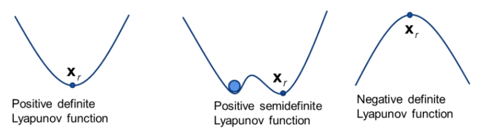

# E 1

> Explain the fundamental differences between Lyapunov stability and asymptotic stability. Which is the most preferred type of stability for spacecraft control laws and why?

**Fundamental Differences Between Lyapunov Stability and Asymptotic Stability:**

1. **Lyapunov Stability**:  
   - **Definition**: An equilibrium point is Lyapunov stable if trajectories starting near the point remain arbitrarily close to it for all future time.  
   - **Behavior**: Perturbations do not cause the system to diverge from the equilibrium, but the state may not return to the equilibrium.  
   - **Analogy**: A ball in a shallow valley stays within the valley if nudged but might oscillate indefinitely.  
   - **Mathematical Requirement**: A Lyapunov function \( V(\mathbf{x}) \) exists such that \( \dot{V}(\mathbf{x}) \leq 0 \) (negative semi-definite).  

2. **Asymptotic Stability**:  
   - **Definition**: An equilibrium point is asymptotically stable if it is Lyapunov stable **and** trajectories starting near the point converge to it as time approaches infinity.  
   - **Behavior**: Perturbations decay over time, driving the system back to the equilibrium.  
   - **Analogy**: A ball in a damped valley returns to the bottom after being nudged.  
   - **Mathematical Requirement**: A Lyapunov function \( V(\mathbf{x}) \) exists such that \( \dot{V}(\mathbf{x}) < 0 \) (negative definite).  

**Preferred Stability for Spacecraft Control Laws:**  
Asymptotic stability is strongly preferred for spacecraft control.

# E 2

> Most of the stability definitions arise from a linearized stability analysis of the nonlinear dynamical systems. What are the condition that must be fulfilled to conclude that the stability behaviour of the nonlinear system is not only local, but global? Do not use the Lyapunov function in your answer, instead use the two-dimensional plots of stable node and stable spiral.

- No regions that lead to unstable behavior
- All regions must converge at the same point

# E 3

> A Lyapunov function is a function with certain properties such as: (i) positive definite about a reference motion, (ii) continuous partial derivatives, (iii) a negative semidefinite first time derivative. Illustrate all these conditions using the ball analogy, i.e. stable equilibrium = ball in the valley, etc. Does a Lyapunov function defined according to the above conditions guarantee global stability? If not, how shall the conditions be changed to guarantee global stability?

- e.g. parabola -> positive definite, continuous = no jumps, negative towards 0
- it does not guarantee global (asymptotic) stability, this needs
   - radial unboundedness
   - negative definiteness ($\dot{V}<0$) instead of negative semidefiniteness ($\dot{V}\leq_{0}$)

# E 4

> A spacecraft is a dynamical system without any attracting force coupled to the position, like the stiffness of a spring. Only the inertia is providing resistance to motions and the coupling is between the rotational velocity and the inertia. A single degree-of-freedom system with the same qualitative behaviour is the mass particle system mẍ = u, where m is the mass, x is the position and u is a control force. If we want to control only the velocity of the particle, but not its position, what Lyanpunov function candidate shall we propose? Is this Lyapunov function globally stabilizing? How does the control force look like for this case? If we also want to control the positions, how should the Lyapunov function change? Explain the meaning of the different terms in the expression for the control force.

To control the velocity of a mass particle system without considering the position, we propose the Lyapunov function candidate based on the kinetic energy of the system. This function is:

\[
\boxed{V = \frac{1}{2} m v^2}
\]

This Lyapunov function is globally stabilizing for the velocity because it is positive definite and its derivative, when using the control force \( u = -k v \), is negative definite. The control force is:

\[
\boxed{u = -k v}
\]

For controlling both the position and velocity, the Lyapunov function must include terms for both the position error and the velocity. The proposed Lyapunov function is:

\[
\boxed{V = \frac{1}{2} k_p (x - x_d)^2 + \frac{1}{2} m v^2}
\]

Here, \( k_p \) is a positive constant for the position error term \( (x - x_d) \), and the velocity term remains the same. The corresponding control force becomes:

\[
\boxed{u = -k_p (x - x_d) - k_d v}
\]

In this control force, the term \( -k_p (x - x_d) \) is the proportional feedback on the position error, providing a restoring force to drive the position to the desired setpoint. The term \( -k_d v \) is the derivative feedback on the velocity, providing damping to dissipate kinetic energy and stabilize the velocity. Together, these terms ensure both position and velocity are controlled effectively.

# C 1

> The test to determine if the Lyapunov function is globally stabilizing is to compute the first time derivative for points away from the equilibrium point, i.e. (positions,velocities)=(non-zero,non-zero). If the first time derivative is negative for (velocities)=(non-zero) but has no dependency on positions, we cannot conclude if the Lyapunov function is a bowl or a channel, with zero first time derivative for all non-zero positions. To determine if the Lyanpunov function is indeed negative definite, we must study higher-order time derivatives. Illustrate why one must study the odd time derivatives, dV /dt and d3 V /dt3 , and not the even ones, d2 V /dt2 and d4 V /dt4 , to determine if the Lyapunov function is negative definite also for all non-zero positions. Hint: draw the Lyapunov function as a function of position and time.

Even ones usually are functions of velocity that cancel out the position term. Therefore, we need to study the odd ones.

- even order time derivatives do not have any information about the _direction_ of change, since they are time symmetric for positive definite Lyapunov functions -> e.g. $x^{4}$ -> 2nd order derivative is $x^2$, which does not reveal whether or not values are going to 0

# A 1

> The Hamiltonian of a nonlinear mechanical system, i.e. the sum of the kinetic and potential energies, is often used as a Lyapunov function for controlling the position and velocity of the system. Consider a damped single degree-of-freedom system, mẍ + cẋ + kx = 0, where m is the mass, c is the velocity-proportional damping and k is the stiffness. A candidate Lyapunov function is the Hamiltoniam. What are the reasons for leaving out the dissipative energy term when writing the Lyapunov function?

What usually is aimed to control is both the velocity and position of the body, therefore what is explored is the global asymptotic stability of those two terms.

- not conservative -> not portrayed in the Hamiltonian
- damping is still captured by deriving and substituting the EOM
- no way to get a negative definite Lyapunov rate with it
- the damping component is essentially the "controller" in this system

# C 2

> When developing control laws for the torques for a spinning spacecraft, one usually specifies that the first time derivative of the Lyapunov function is V̇ = −δωPδω to guarantee that the Lyanpunov function is negative semidefinite for a positive definite velocity feedback gain matrix P. Why do we not also specify a quadratic term in the position errors to guarantee that the Lyapunov function also is negative definite non-zero position error? How can we guarantee that the Lyapunov function is negative definite and not just negative semidefinite?

Because we generally care about the tumbling of the spacecraft, we do not need to guarantee that the Lyapunov function is negative definite for a non-zero position error. What we require from the position is that is stable, therefore negative semi-definite is enough criteria. Also, the target rates can be selected to garantee attiude stability. 

# C 3

> When selecting a Lyapunov function for the spacecraft control law, $V = \frac{1}{2} \delta \omega^T I_c \delta \omega + 2 K \ln (1 + \sigma ^ T \sigma)$ was selected instead of the “Hamiltonian-like”. What is the main reason for selecting a natural logarithm function for the elemental position-based part of the Lyapunov function? Are the position parts of these two different Lyapunov functions bounded or unbounded?

Both are radialy unbounded and the closed loop dynamic that is globaly stable that provides a linear control law 

# E 5

> Using Modified Rodrigues parameters as the attitude description in the control laws for a spinning spacecraft has an advantage that comes as a result of the required switch between original and shadow MRP. Describe what the benefits are of performing the switch between original and shadow MRP on the unit sphere |σ| = 1. Illustrate the physical meaning of the switch for control torques u = −Kσ − P ω − L by drawing a spacecraft rotating around only one of the body-fixed axes (2D case) and express the values of the MRP for different suitable positions during the rotation.

1. **Singularity Avoidance**: MRPs become singular at \(360^\circ\) (unbounded as \(|σ| \to \infty\)). Switching at \(|σ| = 1\) keeps parameters within the unit sphere (\(|σ_s| \leq 1\)), avoiding numerical instability.

2. **Bounded Control Torques**: The term \(-Kσ\) in the control law \(u = -Kσ - Pω - L\) remains bounded, preventing excessive actuator demands. For example, \(|σ| \leq 1\) ensures \(|Kσ| \leq K\), avoiding torque saturation.

3. **Shortest Path Rotation**: Switching ensures the control law always follows the shortest angular path. For a \(180^\circ\) rotation, switching MRPs flips the error direction, enabling torque reversal to stabilize efficiently.

4. **Smooth Transitions**: The switch is continuous on the unit sphere, maintaining control continuity without abrupt changes.

### Physical Illustration (2D Case)
Consider a spacecraft rotating about its \(z\)-axis. Let \(σ = [0, 0, σ_3]\) track the rotation angle \(\theta\):
- **At \(0^\circ\)**: \(σ_3 = 0\). Torque: \(u = -Pω - L\) (no proportional term).
- **At \(90^\circ\)**: \(σ_3 = \tan(22.5^\circ) \approx 0.414\). Torque: \(u = -0.414K - Pω - L\).
- **At \(180^\circ\)**: \(σ_3 = 1\). Switch to shadow MRP \(σ_s = -1\). Torque becomes \(u = K - Pω - L\), reversing the proportional term to decelerate the rotation.
- **At \(270^\circ\)** (equivalent to \(-90^\circ\)): \(σ_s \approx -0.414\). Torque: \(u = 0.414K - Pω - L\).
- **At \(360^\circ\)**: Back to \(σ_3 = 0\), completing the cycle.

# C 4

> In the case of unknown, unmodelled torques ∆L affecting the spacecraft, a control law that is position and velocity proportional, i.e. u = −Kσ−P ω−L, will not converge to the correct attitude as the external torque compensation −L is off by ∆L. Show that the steady-state attitude error is σss = ∆L/K by using a single degree-of-freedom system analogy. How shall the control law be modified to guarantee convergence to the correct attitude? Explain qualitatively what the added control term will do to the control law and why this term indeed guarantee attitude convergence in the presence of unmodelled
torques

- at steady state, $\omega$ is zero, therefore gain $P$ plays no role. The system is therefore balanced by the position proportional component and the unmodelled torque -> $\cancel{ L } + \Delta L = K\sigma_{ss} + \cancel{ L }$ ->   $\sigma_{ss} = \Delta L/K$
- analogy: spring damper system with unmodelled force leads to a steady state where the resulting force of the steady state deflection times the spring constant is equal to the unmodelled force
- Modification by adding an integrator: $u = -K\sigma - P\omega-I\int_{0}^{T}\sigma\text{d}t - L$ 
- $I$ is usually picked to be smaller than $K$ s.t. during the convergence towards the steady state, it barely influences the behavior. Once in a steady state, the integrator term will grow while the position term would stay constant. This results in a force moving the system towards the equilibrium, which leads the position term to shrink. Once the equilibrium state is reached, the position term is zero and the integrator stays constant, balancing against the unmodelled torque (without a deflection from 0)

# A 2

> The not-so-intuitive feedback gains for the attitude and angular velocity errors are selected from desired decay times and natural frequencies for the linearized dynamical error system, IC δ ω̇ = −Pδω−Kσ. This leads to an analogy to the damped single degree-of-freedom damped system, where the feedback gains are connected to the stiffness and viscous damping terms of the single degree-of-freedom system. Such a system can be either under-damped, critically damped and over-damped with exponential convergence to the target state. In the examples in the book and in the lecture slides, we see that the equilibrium attitude and angular velocities are passed more than once despite having feedback gains selected according to the relations for specified decay times and natural frequencies for a critically damped system. What could be the reasons for that behaviour?

Critically damped systems imply the slowest time to converge into a steady state. It doesn't say anything about how many times it goes trough the equilibrium point. This law also is simple and doesn't have feedforward that allow to avoid the crossing.

- due to the Lyapunov function using MRPs and the logarithm function to derive this control law, the closed-loop tracking dynamic are rigorously linear in both body angular velocity and attitude error vectors even for large general motions
- Only non-linearities: MRP kinematic differential equation, linearization around $\sigma=0$ leads to $\dot{\sigma}\approx\frac{1}{4}\omega$
   -> applicable for a relatively large range of motions (better than CRPs with factor one half or Euler angles linearized as angle-type quantities)
- From this linearization onward, standard linear control design methods are used
- additionally: low control authority, selection of under-damped systems, periodicity of the 

# A 3

> The unsaturated control laws have no upper bounds on the control torques, but in reality the control
devices (thrusters and control momentum gyros) always have limits on the maximum torques they can provide. This means that when the unsaturated control law specifies a control torque larger than the torque limits, the control device is set to operate at its limit as long as the control torque commanded by the unsaturated control law is larger than the limit. The saturation of the control device has the effect of delaying the detumbling of the spacecraft as not enough torque can be provided. When studying the stability properties of the Lyapunov optimal control laws, i.e. the time derivative of the Lyapunov function is made as negative as possible, the stability condition K|σi | ≤ umaxi (or K ≤ umaxi ), which connects the attitude feedback gain with the maximum control torques, appears. Limiting K is said to be overly conservative as simulations in the book and the lecture slides show that the solution will convergence despite violating this condition. Provide a physical explanation why a saturated control law eventually will bring a tumbling spacecraft to rest for cases where K > umaxi .

- Consider that for half of the rotation, the a pure position based controller were to be saturated. This would mean that for the part up until the MRP switch, the torque would brake the movement, after the switch it would accelerate (to go towards the regulated position)
- However, we have the velocity based control which is constantly braking -> we have a shorter period of saturated torque accelerating than braking
   -> In total, we have a dissipative energy which is slowly decreasing the angular velocity until the position controller can start to overtake and regulate towards 0